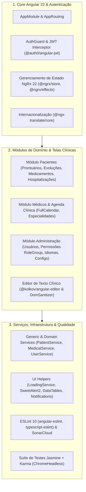

# Diretrizes para Ajuste de Issues e Code Smells — Frontend (SmartDigitalPsicoUI)

**Documento:** Guia operacional específico da SPA Frontend SmartDigitalPsicoUIDashboard  
**Projeto:** [SmartDigitalPsicoUIDashboard/](file:///c:/git/SMARTDIGITALPSICO/SmartDigitalPsicoUIDashboard) (`smartdigitalpsico` — SPA Angular 22 + TypeScript + NgRx 22)  
**Manifesto:** [package.json](file:///c:/git/SMARTDIGITALPSICO/SmartDigitalPsicoUIDashboard/package.json)  
**Configuração Sonar:** [sonar-project.properties](file:///c:/git/SMARTDIGITALPSICO/SmartDigitalPsicoUIDashboard/sonar-project.properties)  
**Guia-Base Genérico:** [Diretrizes-CodeSmell-Frontend-Generico.md](file:///c:/git/SMARTDIGITALPSICO/SmartDigitalPsicoUIDashboard/DOCUMENTACAO/COVERAGE%20AND%20TEST/Diretrizes-CodeSmell-Frontend-Generico.md)  
**Diretrizes de Cobertura:** [Diretrizes-Coverage-Frontend-SmartDigitalPsicoUI.md](file:///c:/git/SMARTDIGITALPSICO/SmartDigitalPsicoUIDashboard/DOCUMENTACAO/COVERAGE%20AND%20TEST/Diretrizes-Coverage-Frontend-SmartDigitalPsicoUI.md)  
**Data da Revisão:** 2026-08-28  

---

## 1. Contexto Arquitetural da Aplicação SmartDigitalPsicoUIDashboard

O **SmartDigitalPsicoUIDashboard** é a Single Page Application (SPA) de atendimento psicológico digital, construída sobre **Angular 22**, **TypeScript**, **NgRx 22 (@ngrx/store, @ngrx/effects)**, **@auth0/angular-jwt**, **@kolkov/angular-editor**, **@ngx-translate/core**, **FullCalendar**, **Chartist**, **DataTables.net**, **Bootstrap 3 (Light Bootstrap Dashboard Pro)** e **Jasmine / Karma**:



---

## 2. Catálogo de Code Smells Específicos e Saneamento no SmartDigitalPsicoUI

### 2.1 Gestão de Subscrições RxJS e Prevenção de Memory Leaks (`typescript:S3800` / `S4200`)
- **Problema:** Realizar subscrições manuais em Observables (`service.getData().subscribe(...)`) em componentes ou serviços sem cancelamento no encerramento (`ngOnDestroy`), gerando vazamento de memória e múltiplas execuções de callbacks em navegações sucessivas.
- **Padrão Homologado no SmartDigitalPsicoUI:**
  - **Abordagem 1 (Recomendada em templates):** Utilizar o pipe `| async` diretamente no HTML, delegando a subscrição e o descarte automático para o framework:
    ```html
    <div *ngIf="patients$ | async as patients">
      <table class="table">...</table>
    </div>
    ```
  - **Abordagem 2 (Operador `takeUntilDestroyed` ou `Subject destroy$`):**
    ```typescript
    import { Component, OnInit, OnDestroy } from '@angular/core';
    import { Subject } from 'rxjs';
    import { takeUntil } from 'rxjs/operators';
    import { PatientService } from 'app/services/general/principals/patient.service';

    @Component({
      selector: 'app-patient-list',
      templateUrl: './patient.component.html'
    })
    export class PatientComponent implements OnInit, OnDestroy {
      private readonly destroy$ = new Subject<void>();

      constructor(private patientService: PatientService) {}

      ngOnInit(): void {
        this.patientService.getAll()
          .pipe(takeUntil(this.destroy$))
          .subscribe({
            next: (data) => this.processData(data),
            error: (err) => this.handleError(err)
          });
      }

      ngOnDestroy(): void {
        this.destroy$.next();
        this.destroy$.complete();
      }
    }
    ```

---

### 2.2 Sanitização Rigorosa de Conteúdo HTML e Prontuários (`typescript:S5147` / `S6096`)
- **Problema:** Prontuários psicológicos, relatórios de atendimento e modelos de notificação utilizam o editor rico `@kolkov/angular-editor`. Inserir conteúdo HTML não confiável via `[innerHTML]` sem sanitização dispara alertas críticos de segurança (Cross-Site Scripting - XSS).
- **Padrão Homologado no SmartDigitalPsicoUI:**
  - Utilizar o serviço `DomSanitizer` do Angular ou sanitizadores padronizados para garantir que o contexto seja estritamente validado:
    ```typescript
    import { Pipe, PipeTransform, SecurityContext } from '@angular/core';
    import { DomSanitizer, SafeHtml } from '@angular/platform-browser';

    @Pipe({ name: 'safeHtml' })
    export class SafeHtmlPipe implements PipeTransform {
      constructor(private sanitizer: DomSanitizer) {}

      transform(value: string | null | undefined): SafeHtml {
        if (!value) return '';
        return this.sanitizer.sanitize(SecurityContext.HTML, value) ?? '';
      }
    }
    ```

---

### 2.3 Tipagem Estrita e Eliminação do `any` (`@typescript-eslint/no-explicit-any`)
- **Problema:** Declarar retornos de serviços genéricos ou payloads de formulários como `any`, desativando a verificação estática de tipos do compilador TypeScript.
- **Padrão Homologado no SmartDigitalPsicoUI:**
  - Toda chamada HTTP deve ser fortemente tipada utilizando os modelos de `src/app/models/`:
    ```typescript
    // Incorreto
    getPatient(id: number): Observable<any> { ... }

    // Correto Homologado
    getPatient(id: number): Observable<PatientModel> {
      return this.http.get<PatientModel>(`${this.baseUrl}/${id}`);
    }
    ```

---

### 2.4 Otimização de Ciclo de Vida e Change Detection (`typescript:S3776`)
- **Problema:** Executar lógica pesada de formatação, ordenação ou filtros complexos dentro de getters de templates invocados repetidamente a cada ciclo de detecção do Zone.js.
- **Padrão Homologado no SmartDigitalPsicoUI:**
  - Pré-calcular valores no momento da atualização do estado ou utilizar Pure Pipes (`@Pipe({ pure: true })`).
  - Em componentes com alto volume de renderização (tabelas de prontuários, agendas), adotar `changeDetection: ChangeDetectionStrategy.OnPush`.

---

## 3. Configuração do Sonar e Exclusões Homologadas

Conforme definido em [sonar-project.properties](file:///c:/git/SMARTDIGITALPSICO/SmartDigitalPsicoUIDashboard/sonar-project.properties):

```properties
# Identificação do Projeto
sonar.projectKey=lionscorp_smartdigitalpsicouidashboard
sonar.organization=lionscorp

# Informações do Projeto
sonar.projectName=lionscorp_smartdigitalpsicouidashboard
sonar.projectVersion=1.0.0

# Diretórios de Código-Fonte
sonar.sources=src
sonar.exclusions=**/*.spec.ts,**/node_modules/**,**/assets/**,**/documentation/**,**/dist/**

# Configurações do TypeScript
sonar.typescript.tsconfigPath=tsconfig.json

# Relatórios de Cobertura de Testes
sonar.javascript.lcov.reportPaths=coverage/lcov.info

# Configurações Adicionais
sonar.sourceEncoding=UTF-8
```

---

## 4. Procedimento Operacional de Saneamento no SmartDigitalPsicoUI

### Passo 1: Análise Estática e Linter

```powershell
cd c:\git\SMARTDIGITALPSICO\SmartDigitalPsicoUIDashboard

# 1. Executar verificação de ESLint com regras do angular-eslint
npm run lint

# 2. Executar verificação de compilação TypeScript
npm run build
```

---

### Passo 2: Aplicação das Correções

Aplicar refatorações limpas nos componentes (`src/app/custompages/`), serviços (`src/app/services/`) e stores (`src/app/storereduxngrx/`), respeitando:
1. Padrões estabelecidos em [Diretrizes-CodeSmell-Frontend-Generico.md](file:///c:/git/SMARTDIGITALPSICO/SmartDigitalPsicoUIDashboard/DOCUMENTACAO/COVERAGE%20AND%20TEST/Diretrizes-CodeSmell-Frontend-Generico.md).
2. Não alteração de contratos visuais, rotas ou contratos de DTOs da API backend.

---

### Passo 3: Validação da Suíte de Testes Automatizados

```powershell
# Executar testes unitários com Karma e coleta de cobertura
npm run test -- --no-watch --no-progress --browsers=ChromeHeadless --code-coverage
```

---

## 5. Checklist de Homologação

- [ ] `npm run lint` conclui com 0 erros e 0 warnings.
- [ ] Compilação TypeScript (`npm run build`) sem erros de tipagem.
- [ ] Todos os testes unitários passando em modo headless (`npm test`).
- [ ] Subscrições RxJS devidamente encerradas via `takeUntilDestroyed` / `destroy$` / `async pipe`.
- [ ] Conteúdo HTML rico em prontuários sanitizado com `DomSanitizer`.
- [ ] Tipos estritos aplicados em todos os serviços e modelos de domínio (sem `any`).
- [ ] Relatório de cobertura gerado em `coverage/lcov.info` e integrado com SonarCloud.

---

## 6. Referências Internas

- [package.json](file:///c:/git/SMARTDIGITALPSICO/SmartDigitalPsicoUIDashboard/package.json) — Manifesto de dependências Angular 22
- [sonar-project.properties](file:///c:/git/SMARTDIGITALPSICO/SmartDigitalPsicoUIDashboard/sonar-project.properties) — Configuração SonarCloud
- [Diretrizes-CodeSmell-Frontend-Generico.md](file:///c:/git/SMARTDIGITALPSICO/SmartDigitalPsicoUIDashboard/DOCUMENTACAO/COVERAGE%20AND%20TEST/Diretrizes-CodeSmell-Frontend-Generico.md) — Guia genérico frontend
- [Diretrizes-Coverage-Frontend-SmartDigitalPsicoUI.md](file:///c:/git/SMARTDIGITALPSICO/SmartDigitalPsicoUIDashboard/DOCUMENTACAO/COVERAGE%20AND%20TEST/Diretrizes-Coverage-Frontend-SmartDigitalPsicoUI.md) — Diretrizes de cobertura frontend SmartDigitalPsico
- [2026-07-LevantamentoConjuntoHomologado-SmartDigitalPsicoUIDashboard.md](file:///c:/git/SMARTDIGITALPSICO/SmartDigitalPsicoUIDashboard/DOCUMENTACAO/UI/2026-07-LevantamentoConjuntoHomologado-SmartDigitalPsicoUIDashboard.md) — Levantamento do ecossistema Angular
