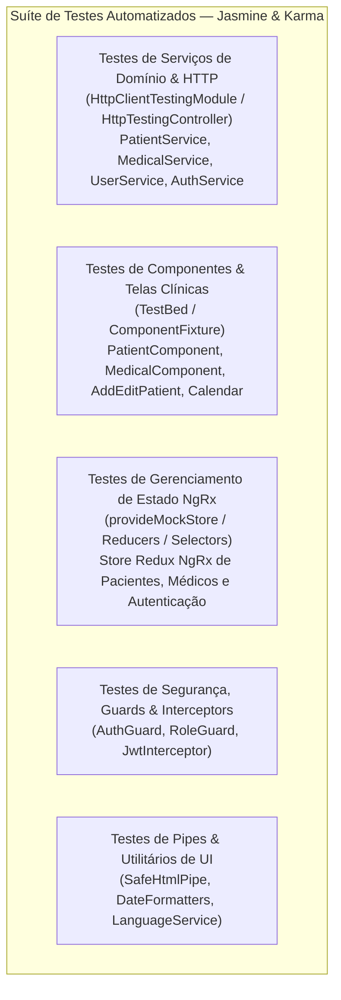

# Diretrizes para Testes Automatizados e Cobertura (Coverage) — Frontend (SmartDigitalPsicoUI)

**Documento:** Guia operacional específico da suíte de testes e cobertura frontend SmartDigitalPsicoUIDashboard  
**Projeto:** [SmartDigitalPsicoUIDashboard/](file:///c:/git/SMARTDIGITALPSICO/SmartDigitalPsicoUIDashboard) (`smartdigitalpsico` — SPA Angular 22 + TypeScript + NgRx 22)  
**Manifesto:** [package.json](file:///c:/git/SMARTDIGITALPSICO/SmartDigitalPsicoUIDashboard/package.json)  
**Meta de Cobertura:** **100% de Linhas e Ramos em Serviços, Guards, Interceptors e Reducers NgRx e >80% em Componentes Visuais**  
**Guia-Base Genérico:** [Diretrizes-Coverage-Frontend-Generico.md](file:///c:/git/SMARTDIGITALPSICO/SmartDigitalPsicoUIDashboard/DOCUMENTACAO/COVERAGE%20AND%20TEST/Diretrizes-Coverage-Frontend-Generico.md)  
**Diretrizes de Code Smells:** [Diretrizes-CodeSmell-SmartDigitalPsicoUI.md](file:///c:/git/SMARTDIGITALPSICO/SmartDigitalPsicoUIDashboard/DOCUMENTACAO/COVERAGE%20AND%20TEST/Diretrizes-CodeSmell-SmartDigitalPsicoUI.md)  
**Data da Revisão:** 2026-08-28  

---

## 1. Mapa Arquitetural da Suíte de Testes do SmartDigitalPsicoUI

A suíte de testes automatizados do **SmartDigitalPsicoUIDashboard** é desenhada sobre **Jasmine** e **Karma**, cobrindo todas as camadas da aplicação Angular:



### 1.1 Detalhamento dos Escopos de Teste

| Escopo | Localização | Framework / Utilitários | Foco Principal e Metas de Cobertura |
| ------ | ----------- | ----------------------- | ----------------------------------- |
| **Serviços de Domínio & HTTP** | `src/app/services/` | Jasmine / `HttpClientTestingModule` | Chamadas de API REST para prontuários, pacientes, médicos, upload de anexos, tratamento de erros HTTP 400/401/404/500 e cabeçalhos de autorização (**Meta: 100%**). |
| **Gerenciamento de Estado NgRx** | `src/app/storereduxngrx/` | Jasmine / `provideMockStore` | Imutabilidade de reducers, despacho de actions, execução de effects e seletores de estado memoizados (**Meta: 100%**). |
| **Guards & Interceptors** | `src/app/services/auth/` | Jasmine / Spies | Proteção de rotas com `AuthGuard`, validação de expiração de token JWT e anexação de `Bearer Token` em requisições (**Meta: 100%**). |
| **Componentes e Telas** | `src/app/custompages/` | Jasmine / `TestBed` | Formulários reativos, validações visuais de campos, renderização de tabelas de pacientes, navegação e modais (**Meta: >80%**). |
| **Pipes e Formatadores** | `src/app/common/` / `src/app/helpers/` | Jasmine puro | Sanitização com `DomSanitizer`, formatação de datas e máscaras de documentos (**Meta: 100%**). |

---

## 2. Stack de Testes Padronizada

Conforme homologado no [package.json](file:///c:/git/SMARTDIGITALPSICO/SmartDigitalPsicoUIDashboard/package.json) e configurado no [karma.conf.js](file:///c:/git/SMARTDIGITALPSICO/SmartDigitalPsicoUIDashboard/karma.conf.js):

- **`jasmine-core 4.4.x` / `@types/jasmine 4.0.x`:** Framework de asserções (`expect`), suites (`describe`), testes (`it`) e spies (`spyOn`).
- **`karma 6.4.x` / `karma-chrome-launcher`:** Test runner de execução automatizada em navegador headless (`ChromeHeadless`).
- **`karma-coverage 2.2.x`:** Coletor de métricas de cobertura no formato LCOV (`coverage/lcov.info`) e HTML.
- **`karma-junit-reporter 2.0.x`:** Gerador de relatórios XML de execução de testes (`coverage/test-results.xml`).

---

## 3. Padrões de Implementação de Testes no Angular

### 3.1 Padrão Tripartite de Nomenclatura (`Metodo_Cenario_Resultado`)
```typescript
describe('PatientService', () => {
  it('getById_WhenPatientExists_ReturnsPatientModel', () => { ... });
  it('create_WhenPayloadIsInvalid_HandlesErrorResponse', () => { ... });
});
```

---

### 3.2 Comentários de Contexto e Estrutura AAA
Todo teste unitário deve conter os comentários `// Cenário:` e `// Objetivo:` em português e blocos `// Arrange`, `// Act`, `// Assert`:

```typescript
// Cenário: Consulta de paciente por ID com retorno de sucesso da API.
// Objetivo: Garantir que o serviço emita o modelo correto deserializado através do Observable.
it('getById_WhenPatientExists_ReturnsPatientModel', () => {
  // Arrange
  const mockPatient: PatientModel = {
    id: 1,
    name: 'João Silva',
    email: 'joao.silva@example.com',
    cpf: '123.456.789-00'
  };

  // Act & Assert
  patientService.getById(1).subscribe((patient) => {
    expect(patient).toEqual(mockPatient);
    expect(patient.name).toBe('João Silva');
  });

  const req = httpTestingController.expectOne(`${environment.apiUrl}/patient/1`);
  expect(req.request.method).toBe('GET');
  req.flush(mockPatient);
});
```

---

### 3.3 Testes de Componentes com TestBed

```typescript
// Cenário: Inicialização da tela de listagem de pacientes.
// Objetivo: Validar que a lista de pacientes seja requisitada no ngOnInit e exibida no template.
it('ngOnInit_WhenLoaded_FetchesAndDisplaysPatients', () => {
  // Arrange
  const mockPatients: PatientModel[] = [
    { id: 1, name: 'Paciente A', email: 'a@test.com' },
    { id: 2, name: 'Paciente B', email: 'b@test.com' }
  ];
  spyOn(patientService, 'getAll').and.returnValue(of(mockPatients));

  // Act
  fixture.detectChanges(); // Aciona ngOnInit

  // Assert
  expect(patientService.getAll).toHaveBeenCalledTimes(1);
  expect(component.patients.length).toBe(2);
});
```

---

## 4. Gestão de Gaps de Cobertura e Exclusões Homologadas

### 4.1 Tratamento de Gaps de Cobertura
Ao inspecionar o relatório de cobertura `coverage/lcov.info` ou o relatório HTML gerado em `coverage/index.html`:
1. **Priorizar Serviços e Reducers:** Garantir 100% de cobertura nos fluxos de dados e tratamento de exceções.
2. **Cobrir Ramos Condicionais (*Branch Coverage*):** Validar estados de erro, fluxos alternativos de formulários e verificações de permissões.

### 4.2 Exclusões Homologadas no Sonar
```properties
sonar.exclusions=**/*.spec.ts,**/node_modules/**,**/assets/**,**/documentation/**,**/dist/**
sonar.javascript.lcov.reportPaths=coverage/lcov.info
```

---

## 5. Procedimento Operacional de Execução dos Testes

```powershell
cd c:\git\SMARTDIGITALPSICO\SmartDigitalPsicoUIDashboard

# 1. Executar testes em modo interativo (desenvolvimento local)
npm test

# 2. Executar suíte completa com ChromeHeadless e geração de cobertura (CI/CD)
npm run test -- --no-watch --no-progress --browsers=ChromeHeadless --code-coverage

# 3. Visualizar relatório HTML de cobertura
# Abrir o arquivo coverage/index.html no navegador
```

---

## 6. Checklist de Homologação de Testes

- [ ] Todos os testes da suíte executando e passando em modo headless com 100% de sucesso (0 falhas).
- [ ] Testes nomeados no padrão `Metodo_Cenario_Resultado`.
- [ ] Comentários em português `// Cenário:` e `// Objetivo:` presentes acima de cada teste.
- [ ] Blocos `// Arrange`, `// Act`, `// Assert` demarcados explicitamente.
- [ ] Requisições HTTP mockadas via `HttpTestingController` ou Spies de Jasmine sem dependência de backend ativo.
- [ ] `httpTestingController.verify()` invocado em `afterEach` para assegurar que não há requisições pendentes.
- [ ] Relatório `coverage/lcov.info` gerado com métricas em conformidade com o Quality Gate.

---

## 7. Referências Internas

- [package.json](file:///c:/git/SMARTDIGITALPSICO/SmartDigitalPsicoUIDashboard/package.json) — Manifesto de pacotes da SPA Angular 22
- [karma.conf.js](file:///c:/git/SMARTDIGITALPSICO/SmartDigitalPsicoUIDashboard/karma.conf.js) — Configuração do test runner Karma
- [sonar-project.properties](file:///c:/git/SMARTDIGITALPSICO/SmartDigitalPsicoUIDashboard/sonar-project.properties) — Configuração SonarCloud
- [Diretrizes-Coverage-Frontend-Generico.md](file:///c:/git/SMARTDIGITALPSICO/SmartDigitalPsicoUIDashboard/DOCUMENTACAO/COVERAGE%20AND%20TEST/Diretrizes-Coverage-Frontend-Generico.md) — Guia genérico de testes frontend
- [Diretrizes-CodeSmell-SmartDigitalPsicoUI.md](file:///c:/git/SMARTDIGITALPSICO/SmartDigitalPsicoUIDashboard/DOCUMENTACAO/COVERAGE%20AND%20TEST/Diretrizes-CodeSmell-SmartDigitalPsicoUI.md) — Diretrizes de Code Smells frontend SmartDigitalPsico
- [2026-07-LevantamentoConjuntoHomologado-SmartDigitalPsicoUIDashboard.md](file:///c:/git/SMARTDIGITALPSICO/SmartDigitalPsicoUIDashboard/DOCUMENTACAO/UI/2026-07-LevantamentoConjuntoHomologado-SmartDigitalPsicoUIDashboard.md) — Levantamento técnico da SPA Angular
