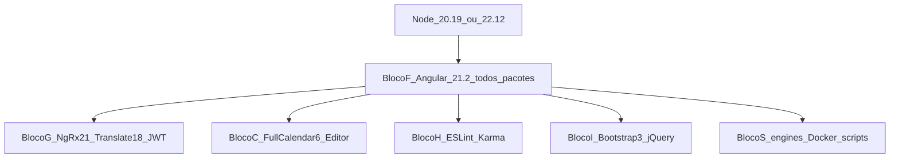

# Levantamento e Conjunto Homologado — SmartDigitalPsicoUIDashboard (Angular)

**Documento:** Inventário completo (`package.json`) + Conjunto Homologado do ciclo  
**Projeto:** `SmartDigitalPsicoUIDashboard/`  
**Fonte de versões atuais:** [`package.json`](../../package.json) (2026-07-31)  
**Framework atual:** **Angular 14** (`^14.2.0` / lock ~14.3.0) — EOL  
**Framework alvo (Conjunto v1):** **Angular 21.2.x** (upgrade **passo a passo** 15→…→21)  
**Node engines hoje:** `18.14.2` / npm `9.6.3` (pin exato)  
**Processo-base:** `SmartDigitalPsicoAPI/DOCUMENTACAO/GuiaGenericoAtualizacaoPacotes.md`  
**Plano:** `DOCUMENTACAO/UI/PlanoImplementacaoAtualizacaoAngular-SmartDigitalPsicoUIDashboard.md`  
**Relatório:** `DOCUMENTACAO/UI/RelatorioAtualizacaoAngular-SmartDigitalPsicoUIDashboard.md`

---

## 1. Objetivo

Homologar **todas** as dependências do `package.json` (dependencies + devDependencies + engines + scripts) para:

1. Manter **Angular** (não React) e sair do Angular 14 EOL até **21.2.x**
2. Alinhar **cada** pacote `@angular/*` na **mesma** major/minor/patch do destino
3. Atualizar satélites com peer compatível (NgRx, translate, JWT, FullCalendar, editor, etc.)
4. Remover tooling morto e deps ruído; alinhar Node/Docker/scripts
5. Preservar Bootstrap 3 + jQuery no v1 (modernização UI = v2)

Este documento **não implementa** código — só especifica o conjunto.

---

## 2. Escopo e não escopo

### 2.1 Escopo

- Todos os pacotes listados nas seções **4 e 7** (inventário 1:1 com `package.json`)
- Upgrade Angular major a major + alinhamento NgRx/CLI/TypeScript/zone/rxjs
- TSLint/Codelyzer → ESLint; remoção Protractor
- Higiene: remoção de deps não usadas; scripts `--configuration`
- Engines + Dockerfile sem `--force`

### 2.2 Não escopo

- Migração para React  
- Bootstrap 5 / Material / PrimeNG  
- Angular **22** (Conjunto v2 — exige TS 6 + Node 22.22.3+)  
- Standalone em massa / application builder obrigatório  
- Ampliar suíte de testes do zero  
- Backend API  

---

## 3. Inventário do projeto

| Item | Valor |
| ---- | ----- |
| App | SPA Angular (Light Bootstrap Dashboard Pro) |
| Projeto CLI | `pd-pro-angularcli` |
| Bootstrap app | `AppModule` via `platformBrowserDynamic` — NgModules |
| Auth | `@auth0/angular-jwt` + guards (sem MSAL) |
| Estado | `@ngrx/store` / `effects` / `store-devtools` |
| i18n | `@ngx-translate/*` + messageformat |
| UI | Bootstrap **3** + jQuery + plugins (scripts em `angular.json`) |
| Build | `@angular-builders/custom-webpack` + `webpack` + `null-loader` |
| Testes | Karma/Jasmine (~1 spec); Protractor e2e (1 spec) |
| Lint | TSLint + `codelyzer` |
| Total deps + devDeps no `package.json` | **61 + 26 = 87** entradas de pacote |

---

## 4. Inventário completo — `dependencies` (estado atual)

### 4.1 Família `@angular/*` (obrigatório subir juntos)

| Pacote | Versão atual (`package.json`) | Destino Conjunto v1 | Notas |
| ------ | ----------------------------- | ------------------- | ----- |
| `@angular/animations` | `^14.2.0` | **~21.2.x** | Mesmo patch da família |
| `@angular/cdk` | `^14.2.0` | **~21.2.x** | CDK separado do Material (Material não está no projeto) |
| `@angular/common` | `^14.2.0` | **~21.2.x** | — |
| `@angular/compiler` | `^14.2.0` | **~21.2.x** | — |
| `@angular/core` | `^14.2.0` | **~21.2.x** | Âncora do upgrade |
| `@angular/elements` | `^14.2.0` | **~21.2.x** | Manter se usado; senão avaliar remoção pós-grep |
| `@angular/forms` | `^14.2.0` | **~21.2.x** | — |
| `@angular/google-maps` | `^14.2.0` | **~21.2.x** | Coexiste com `@ngui/map` / `@types/googlemaps` |
| `@angular/localize` | `^14.2.0` | **~21.2.x** | — |
| `@angular/platform-browser` | `^14.2.0` | **~21.2.x** | — |
| `@angular/platform-browser-dynamic` | `^14.2.0` | **~21.2.x** | — |
| `@angular/router` | `^14.2.0` | **~21.2.x** | — |

**Regra:** em cada major intermediária (15…21), **todos** os `@angular/*` acima sobem juntos via `ng update`. Proibido misturar majors (ex.: core 21 + forms 14).

### 4.2 Plataforma runtime Angular-adjacente

| Pacote | Atual | Destino v1 | Política |
| ------ | ----- | ---------- | -------- |
| `rxjs` | `~7.5.0` | **~7.8.x** (peer Angular 21 / NgRx 21) | Subir com o framework |
| `zone.js` | `~0.11.4` | **~0.15.x** (matriz Angular 21) | Subir com o framework |
| `rxjs-compat` | `6.6.7` | **Remover** se grep sem uso | Débito RxJS 5/6 |
| `core-js` | `3.8.1` | Avaliar remoção / polyfills modernos | Angular 21 reduz necessidade |
| `web-animations-js` | `2.3.2` | **Remover** (import já comentado em `polyfills.ts`) | Dead |
| `tslib` | (transitivo) | Deixar transitivo do Angular | Não pinar em dependencies se não existir |

### 4.3 Estado, auth, i18n

| Pacote | Atual | Destino v1 | Política |
| ------ | ----- | ---------- | -------- |
| `@ngrx/store` | `^14.0.1` | **~21.1.x** (`ng update @ngrx/store@21`) | Major = Angular |
| `@ngrx/effects` | `^14.0.1` | **~21.1.x** | Idem |
| `@ngrx/store-devtools` | `^14.0.1` | **~21.1.x** | Idem |
| `@auth0/angular-jwt` | `^5.1.2` | Latest **5.x** estável peer Angular 21 | Sem MSAL |
| `@ngx-translate/core` | `^14.0.0` | **18.x** (matriz ngx-translate: Angular 18–22) | Breaking de API possível — smoke i18n |
| `@ngx-translate/http-loader` | `^7.0.0` | **18.x** (alinhar ao core) | Idem |
| `ngx-translate-messageformat-compiler` | `^6.2.0` | Latest estável peer translate 18 / Angular 21 | Validar compile |
| `@messageformat/core` | `^3.1.0` | Latest estável exigido pelo compiler | — |

### 4.4 Editor, calendar, maps, autocomplete (Angular wrappers)

| Pacote | Atual | Destino v1 | Política |
| ------ | ----- | ---------- | -------- |
| `@kolkov/angular-editor` | `^3.0.0-beta.2` | Latest **estável** peer Angular 21 (ex.: 3.0.x estável; evitar 3.1 se for Angular 22+) | Sair de beta |
| `@fullcalendar/angular` | `^5.11.3` | **6.x** peer Angular 12–21 + `@fullcalendar/core ~6.1.x` | Major breaking; smoke agenda |
| `@fullcalendar/daygrid` | `^5.11.3` | **~6.1.x** alinhado ao core | Família FullCalendar 6 |
| `@fullcalendar/interaction` | `^5.11.3` | **~6.1.x** | Idem |
| `@fullcalendar/timegrid` | `^5.11.3` | **~6.1.x** | Idem |
| `fullcalendar` (v3 jQuery) | `3.10.1` | **Manter no v1** se script em `angular.json` ainda usado; consolidar no **v2** | Dual stack |
| `@ngui/map` | `0.30.3` | **Risco alto** — lib antiga; validar em cada major; substituir por `@angular/google-maps` no v1 se quebrar | Usado em `maps.module.ts` |
| `@types/googlemaps` | `3.40.5` | Migrar para `@types/google.maps` (pacote atual) quando possível | Types legados |
| `angular-ng-autocomplete` | `^2.0.12` | Latest peer Angular 21 **ou** pin + documentar se abandonado | Usado em `app.module` / calendar |
| `ngx-chips` | `2.2.2` | Latest peer Angular 21 **ou** risco de abandono | Usado em `forms.module` |
| `ng2-nouislider` | `1.8.2` | Validar peer; possível substituição no v2 | Usado em `forms.module` |
| `jw-bootstrap-switch-ng2` | `2.0.5` | **Risco alto** — validar por major; pode exigir fork/alternativa | Usado em vários modules |

### 4.5 UI legada Bootstrap 3 + jQuery (scripts `angular.json`)

| Pacote | Atual | Destino v1 | Política |
| ------ | ----- | ---------- | -------- |
| `bootstrap` | `^3.4.1` | **^3.4.1** (manter major 3) | Sem Bootstrap 5 no v1 |
| `jquery` | `3.5.1` | **3.7.x** patch segurança se sem breaking | Script global |
| `jquery-validation` | `^1.19.2` | Latest 1.x estável | — |
| `bootstrap-notify` | `3.1.3` | Manter / patch se existir | Script global |
| `bootstrap-select` | `1.13.18` | Manter | Script global |
| `bootstrap-switch` | `3.4.0` | Manter | Script global |
| `bootstrap-tagsinput` | `0.7.1` | Manter | Script global |
| `jasny-bootstrap` | `4.0.0` | Manter | Script global |
| `twitter-bootstrap-wizard` | `1.2.0` | Manter | Script global |
| `eonasdan-bootstrap-datetimepicker` | `^4.15.35` | Manter | Depende de moment/jQuery |
| `datatables` | `1.10.18` | Avaliar alinhar a `datatables.net*` | Possível redundância |
| `datatables.net-bs` | `1.11.5` | Latest 1.x / 2.x só se smoke OK | Preferir patch na linha atual |
| `datatables.net-responsive` | `2.2.9` | Alinhar à família DataTables escolhida | — |
| `chartist` | `0.11.4` | Manter / patch | Script global |
| `chartist-plugin-zoom` | `0.6.0` | Manter | — |
| `chosen-js` | `1.8.7` | Manter | — |
| `nouislider` | `14.6.3` | Latest 15.x só com teste `ng2-nouislider` | Peer do wrapper |
| `sweetalert2` | `10.12.5` | Latest estável **com smoke** (API mudou em majors) | Pode exigir ajuste de imports |
| `moment` | `^2.30.1` | Manter no v1 | Migrar date-fns = v2 |

### 4.6 Build / utilitários misturados em `dependencies`

| Pacote | Atual | Destino v1 | Política |
| ------ | ----- | ---------- | -------- |
| `webpack` | `^5.77.0` | Remover do `dependencies` se só transitivo do CLI; senão alinhar ao exigido pelo custom-webpack 21 | Não deve ser dep de app |
| `null-loader` | `^4.0.1` | Manter enquanto `custom-webpack.config.js` precisar | Build |
| `force` | `^0.0.3` | **Remover** (ruído; não é dep de app) | Grep: sem uso |
| `cli-update` | `^3.2.7` | **Remover** se sem uso | Ruído |
| `cors` | `^2.8.5` | **Remover** do frontend se sem uso no browser bundle | Tipicamente backend |

---

## 5. Inventário completo — `devDependencies` (estado atual)

### 5.1 Tooling Angular CLI / build

| Pacote | Atual | Destino v1 | Política |
| ------ | ----- | ---------- | -------- |
| `@angular/cli` | `~14.2.7` | **~21.2.x** | `ng update` |
| `@angular/compiler-cli` | `^14.2.0` | **~21.2.x** | Família Angular |
| `@angular/language-service` | `14.2.0` | **~21.2.x** | IDE |
| `@angular-devkit/build-angular` | `^14.2.7` | **~21.2.x** | Família |
| `@angular-builders/custom-webpack` | `^14.1.0` | Major **compatível com Angular 21** **ou** remover se builder padrão bastar | Revalidar a cada major |
| `typescript` | `~4.7.2` | **~5.9.x** (matriz Angular 21) | Não subir para 6.x no v1 |

### 5.2 Lint (legado → substituir)

| Pacote | Atual | Destino v1 | Política |
| ------ | ----- | ---------- | -------- |
| `codelyzer` | `^0.0.28` | **Remover** | Substituir por `@angular-eslint/*` |
| (tslint implícito via builder) | presente no projeto | **Remover** `tslint.json` + builder | — |
| `@angular-eslint/schematics` (+ eslint, template-parser, etc.) | ausente | **Adicionar** versão alinhada Angular 21 | Novo |

### 5.3 Testes unitários (Karma / Jasmine)

| Pacote | Atual | Destino v1 | Política |
| ------ | ----- | ---------- | -------- |
| `jasmine-core` | `~4.4.0` | Versão trazida / peer Angular 21 CLI | `ng update` |
| `@types/jasmine` | `~4.0.0` | Alinhar a jasmine-core | — |
| `jasmine-spec-reporter` | `~7.0.0` | Manter ou latest 7.x | — |
| `karma` | `~6.4.0` | Alinhar ao CLI 21 | — |
| `karma-chrome-launcher` | `~3.1.0` | Latest 3.x coeso | — |
| `karma-coverage` | `~2.2.0` | Alinhar | — |
| `karma-coverage-istanbul-reporter` | `~3.0.3` | Preferir `karma-coverage` moderno; remover istanbul reporter se redundante | Limpeza |
| `karma-jasmine` | `~5.1.0` | Alinhar | — |
| `karma-jasmine-html-reporter` | `~2.0.0` | Alinhar | — |
| `karma-junit-reporter` | `^2.0.1` | Manter / latest 2.x | CI Sonar |

### 5.4 E2E legado

| Pacote | Atual | Destino v1 | Política |
| ------ | ----- | ---------- | -------- |
| `protractor` | `^3.3.0` | **Remover** | Descontinuado |
| `@types/jasminewd2` | `~2.0.10` | **Remover** | Só Protractor |
| script `e2e` / projeto `*-e2e` | presente | Remover ou desativar | v2 = Cypress/Playwright |

### 5.5 Types e utilitários dev

| Pacote | Atual | Destino v1 | Política |
| ------ | ----- | ---------- | -------- |
| `@types/node` | `^17.0.21` | Types da linha Node 20/22 | Engines novos |
| `@types/jquery` | `3.5.2` | Latest 3.x | — |
| `@types/bootstrap` | `5.0.1` | **Atenção:** types BS5 com runtime BS3 — alinhar types a **3.x** ou documentar drift | Corrigir drift |
| `@types/chartist` | `0.11.0` | Manter / latest | — |
| `ts-node` | `~10.9.1` | Latest 10.x se ainda necessário | — |

---

## 6. Engines, scripts e problemas

### 6.1 Engines

| Campo | Atual | Destino v1 |
| ----- | ----- | ---------- |
| `engines.node` | `18.14.2` (exato) | `^20.19.0 \|\| ^22.12.0 \|\| ^24.0.0` |
| `engines.npm` | `9.6.3` (exato) | Remover pin exato ou range flexível |

### 6.2 Scripts a corrigir

| Script atual | Problema | Destino |
| ------------ | -------- | ------- |
| `build --env=prod` | Flag CLI antiga; nome inválido com espaço | `build:prod` → `ng build --configuration=production` |
| `build --env=homo` | Idem | `build:homo` → `ng build --configuration=homologation` |
| `e2e` | Protractor | Remover |
| `lint` | TSLint | ESLint via `ng lint` pós-schematic |
| `install:clean` | Apaga lockfile | Manter só se consciente; preferir `npm ci` |

### 6.3 Problemas detectados

| ID | Problema | Tratamento v1 |
| -- | -------- | ------------- |
| A1 | Angular 14 EOL + 12 pacotes `@angular/*` desatualizados | Stepwise → 21.2.x |
| A2 | NgRx 14 vs Angular alvo 21 | NgRx **21.1.x** |
| A3 | translate core 14 / http-loader 7 | Subir ambos para **18.x** |
| A4 | FullCalendar Angular 5 + script `fullcalendar@3` | Angular pkgs → **6.x**; script v3 manter até v2 |
| A5 | `angular-editor` beta | Estável peer Angular 21 |
| A6 | Wrappers legados (`jw-bootstrap-switch-ng2`, `@ngui/map`, `ngx-chips`) | Validar por major; desvio documentado |
| A7 | `@types/bootstrap@5` vs `bootstrap@3` | Corrigir types |
| A8 | Deps ruído (`force`, `cli-update`, `cors`) | Remover |
| A9 | `webpack` em dependencies | Remover/realocar |
| A10 | TSLint / Protractor / Codelyzer | Remover; ESLint |
| A11 | Node engines 18.14.2 exato | Matriz Angular 21 |
| A12 | Docker `--force` | Eliminar |
| A13 | Quase zero testes | Smoke manual obrigatório |

---

## 7. Conjunto Homologado v1 — destino e blocos

### 7.1 Grafo



### 7.2 Dependências rígidas

| Se usar | Então obrigatoriamente |
| ------- | ---------------------- |
| Qualquer `@angular/*` **21.2.x** | **Todos** os 12 pacotes Angular da §4.1 no **mesmo** 21.2.x |
| CLI / compiler-cli / build-angular / language-service | **21.2.x** |
| `@ngrx/*` | **21.x** |
| `@ngx-translate/core` **18** | `http-loader` **18** |
| `@fullcalendar/angular` **6** | daygrid/timegrid/interaction/core **~6.1.x** alinhados |
| TypeScript | **~5.9** (não 6.x) |
| Bootstrap runtime **3** | Não misturar Bootstrap 5; ajustar `@types/bootstrap` |

### 7.3 Caminho Angular (não pular)

```text
14 → 15 → 16 → 17 → 18 → 19 → 20 → 21.2.x
```

Em **cada** major: atualizar a família completa `@angular/*` + CLI + build-angular + cdk/google-maps/localize/elements + NgRx da mesma major + build + smoke.

### 7.4 Amostra destino (trecho `package.json`)

```json
{
  "engines": {
    "node": "^20.19.0 || ^22.12.0 || ^24.0.0"
  },
  "dependencies": {
    "@angular/animations": "~21.2.0",
    "@angular/cdk": "~21.2.0",
    "@angular/common": "~21.2.0",
    "@angular/compiler": "~21.2.0",
    "@angular/core": "~21.2.0",
    "@angular/elements": "~21.2.0",
    "@angular/forms": "~21.2.0",
    "@angular/google-maps": "~21.2.0",
    "@angular/localize": "~21.2.0",
    "@angular/platform-browser": "~21.2.0",
    "@angular/platform-browser-dynamic": "~21.2.0",
    "@angular/router": "~21.2.0",
    "@ngrx/effects": "^21.1.0",
    "@ngrx/store": "^21.1.0",
    "@ngrx/store-devtools": "^21.1.0",
    "@ngx-translate/core": "^18.0.0",
    "@ngx-translate/http-loader": "^18.0.0",
    "@fullcalendar/angular": "^6.1.19",
    "@fullcalendar/daygrid": "~6.1.19",
    "@fullcalendar/interaction": "~6.1.19",
    "@fullcalendar/timegrid": "~6.1.19",
    "bootstrap": "^3.4.1",
    "rxjs": "~7.8.0",
    "zone.js": "~0.15.0"
  },
  "devDependencies": {
    "@angular/cli": "~21.2.0",
    "@angular/compiler-cli": "~21.2.0",
    "@angular/language-service": "~21.2.0",
    "@angular-devkit/build-angular": "~21.2.0",
    "typescript": "~5.9.0"
  }
}
```

> Patch exato (21.2.N, NgRx 21.1.N, FullCalendar 6.1.N) a cravar na execução com `npm view` / `ng update`. Removidos do destino: `force`, `cli-update`, `cors` (se unused), `protractor`, `codelyzer`, `@types/jasminewd2`, `rxjs-compat`, `web-animations-js`.

### 7.5 Checklist de remoção / adição no v1

| Remover | Adicionar |
| ------- | --------- |
| `force`, `cli-update`, `cors` (se unused) | `@angular-eslint/*` + `eslint` |
| `codelyzer`, Protractor, `@types/jasminewd2` | — |
| `rxjs-compat`, `web-animations-js` | — |
| `webpack` de `dependencies` (se possível) | — |
| Scripts `--env=*` | Scripts `build:prod` / `build:homo` |

---

## 8. O que **não** aplicar no v1

| Tentativa | Motivo | Correto |
| --------- | ------ | ------- |
| Pular majors Angular | Quebra schematics/peers | 15…21 sequencial |
| Angular **22** | TS 6 + Node 22.22.3+ | Conjunto v2 |
| Só atualizar `@angular/core` | Grafo inconsistente | **Toda** a família §4.1 |
| Bootstrap **5** | Redesign | v2 |
| Manter translate 14 com Angular 21 | Peers | translate **18** |
| Manter FullCalendar Angular 5 | Peers | Família **6.x** |
| `npm install --force` | Esconde conflitos | Resolver peers |

---

## 9. Conjunto Homologado v2 — futuro

| Item | v1 | v2 |
| ---- | -- | -- |
| Angular | **21.2.x** | **22.x** |
| UI | Bootstrap 3 + jQuery | BS5 / Material; limpar scripts globais |
| FullCalendar | Angular 6 + script v3 residual | Só stack moderna |
| `@ngui/map` / switch / chips | Validados ou pinados | Substituir por componentes mantidos |
| E2E | Sem Protractor | Cypress/Playwright |
| moment | Mantido | date-fns / Temporal |

---

## 10. Evidências

```text
Fonte: SmartDigitalPsicoUIDashboard/package.json
Data inventário: 2026-07-31
dependencies: 61 pacotes
devDependencies: 26 pacotes
@angular/* (runtime): 12 pacotes todos em ^14.2.0
@angular tooling (dev): cli/build-angular/compiler-cli/language-service 14.x
NgRx: 3 pacotes ^14.0.1
```

Revalidar na Fase 0:

```powershell
cd SmartDigitalPsicoUIDashboard
npm outdated
npm ls --depth=0
npm audit --omit=dev
```

---

## 11. Próximo passo

**`DOCUMENTACAO/UI/PlanoImplementacaoAtualizacaoAngular-SmartDigitalPsicoUIDashboard.md`**

Depois preencher o relatório.
