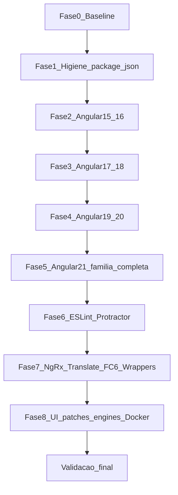

# Plano de Implementação — Atualização SmartDigitalPsicoUIDashboard (Angular 14 → 21)

**Documento:** Plano operacional executável  
**Projeto:** `SmartDigitalPsicoUIDashboard/`  
**Conjunto Homologado (inventário 1:1 do `package.json`):** `DOCUMENTACAO/UI/2026-07-LevantamentoConjuntoHomologado-SmartDigitalPsicoUIDashboard.md`  
**Processo-base:** `SmartDigitalPsicoAPI/DOCUMENTACAO/GuiaGenericoAtualizacaoPacotes.md`  
**Data:** 2026-07-31 (revisado com inventário completo de pacotes)  
**Status:** Planejado (não executado)

---

## 1. Objetivo

Atualizar **todas** as entradas do [`package.json`](../../package.json) (**61** dependencies + **26** devDependencies), **mantendo Angular**, de **14** até **21.2.x**, com:

1. Família completa `@angular/*` (12 pacotes runtime + CLI/compiler-cli/build-angular/language-service) sempre na **mesma** versão  
2. Satélites: NgRx **21**, ngx-translate **18**, FullCalendar **6**, JWT, editor, wrappers UI  
3. Remoções: Protractor, Codelyzer/TSLint, `force`/`cli-update`/`cors` (se unused), `rxjs-compat`, `web-animations-js`  
4. Bootstrap **3** + jQuery **mantidos** (sem redesign)  
5. Build + smoke manual em cada major (quase sem testes)

---

## 2. Escopo — pacotes cobertos

Tratar explicitamente os blocos do levantamento:

| Bloco | Pacotes (resumo) |
| ----- | ---------------- |
| F | 12× `@angular/*` + CLI + build-angular + compiler-cli + language-service + custom-webpack + typescript + rxjs + zone.js |
| G | `@ngrx/*` (3), `@auth0/angular-jwt`, `@ngx-translate/*`, messageformat |
| C | `@fullcalendar/*` (4) + `fullcalendar@3`, `@kolkov/angular-editor`, `@ngui/map`, autocomplete, ngx-chips, ng2-nouislider, jw-bootstrap-switch-ng2 |
| I | bootstrap 3, jquery, plugins (notify/select/switch/tagsinput/datatables/chartist/sweetalert2/moment/…) |
| H | Karma/Jasmine set; remover protractor + codelyzer; adicionar `@angular-eslint` |
| S | engines, scripts, Docker, remoção webpack de dependencies / null-loader |

---

## 3. Pré-requisitos e baseline

| Item | Valor |
| ---- | ----- |
| Branch | `chore/update-packages-smartdigitalpsicouidashboard-angular21` |
| Node destino | `^20.19.0 \|\| ^22.12.0 \|\| ^24.0.0` |
| Versões | Somente Conjunto Homologado v1 |

```powershell
cd SmartDigitalPsicoUIDashboard
node --version
npm ci
npm outdated
npm ls --depth=0
npm audit --omit=dev
npm run build -- --configuration=production
npm test -- --watch=false --browsers=ChromeHeadless
```

**Baseline a registrar:**

```text
@angular/core: 14.x
Demais @angular/*: listar se drift
NgRx / translate / fullcalendar: versões atuais
Build: OK/FAIL
npm outdated: N pacotes
Smoke: OK/FAIL
```

---

## 4. Regra de ouro

Após **cada** major Angular:

1. Confirmar `npm ls @angular/core @angular/common @angular/compiler @angular/forms @angular/router @angular/cli --depth=0` — **mesma major**.  
2. `ng build --configuration=production`  
3. `ng test --watch=false --browsers=ChromeHeadless`  
4. Smoke manual (login, menu, CRUD, i18n, calendário/editor se aplicável)

```powershell
ng update @angular/core@N @angular/cli@N
# Incluir explicitamente pacotes Angular que o schematic não puxe:
# cdk, google-maps, localize, elements, animations, forms, etc. se ficarem para trás
```

---

## 5. Fases



### Fase 0 — Baseline

Inventário + build + smoke no estado Angular 14. Commit opcional de baseline.

### Fase 1 — Higiene `package.json`

1. Remover (após grep): `force`, `cli-update`, `cors`, `rxjs-compat`, `web-animations-js`.  
2. Remover `webpack` de `dependencies` se o CLI/custom-webpack já o trazem.  
3. Corrigir scripts:
   - `build:prod` → `ng build --configuration=production`
   - `build:homo` → `ng build --configuration=homologation`
4. Corrigir drift `@types/bootstrap@5` → types compatíveis com Bootstrap **3** (ou documentar exceção).  
5. `npm ci` **sem** `--force`.

### Fase 2 — Angular 15 e 16

Para cada major N ∈ {15,16}:

```powershell
ng update @angular/core@N @angular/cli@N
# Garantir os 12 @angular/* + cdk/google-maps/localize/elements/language-service
ng update @ngrx/store@N
# custom-webpack major N se existir
```

Build + smoke. Atualizar `zone.js` / `typescript` conforme matriz da major.

### Fase 3 — Angular 17 e 18

Idem. **Não** migrar obrigatoriamente para application builder. Manter NgModules.  
Em Angular 18: avaliar subir `@ngx-translate/*` para **17/18** (matriz ngx-translate) — pode adiar para Fase 7 se peers ainda aceitarem versão intermediária.

### Fase 4 — Angular 19 e 20

Idem. Revalidar wrappers: `jw-bootstrap-switch-ng2`, `@ngui/map`, `ngx-chips`, `ng2-nouislider`, `angular-ng-autocomplete`.  
Se algum quebrar: pin documentado ou substituição mínima (preferir `@angular/google-maps` no lugar de `@ngui/map`).

### Fase 5 — Angular 21 — família completa

```powershell
# Node já na matriz Angular 21
ng update @angular/core@21 @angular/cli@21
npm ls --depth=0 | Select-String "@angular/"
```

**Checklist família Angular (todos ~21.2.x):**

- [ ] animations, cdk, common, compiler, core, elements  
- [ ] forms, google-maps, localize  
- [ ] platform-browser, platform-browser-dynamic, router  
- [ ] cli, compiler-cli, language-service, build-angular  
- [ ] typescript ~5.9, rxjs ~7.8, zone.js ~0.15  

### Fase 6 — ESLint + remoção Protractor/TSLint

1. Remover `codelyzer`, `protractor`, `@types/jasminewd2`, builder tslint, script `e2e`.  
2. `ng add @angular-eslint/schematics` (versão Angular 21).  
3. Manter Karma/Jasmine/karma-junit-reporter; limpar `karma-coverage-istanbul-reporter` se redundante com `karma-coverage`.  
4. `npm run lint` + build.

### Fase 7 — Satélites (NgRx, translate, FullCalendar 6, editor, JWT)

```powershell
ng update @ngrx/store@21
npm install @ngrx/effects@21 @ngrx/store-devtools@21
npm install @ngx-translate/core@18 @ngx-translate/http-loader@18
# messageformat / compiler — latest peer
npm install @fullcalendar/angular@6 @fullcalendar/daygrid@6.1 @fullcalendar/timegrid@6.1 @fullcalendar/interaction@6.1
# editor estável peer Angular 21
npm install @auth0/angular-jwt@latest
```

**Atenção FullCalendar:** manter `fullcalendar@3.10.1` no v1 se ainda referenciado em `angular.json` scripts; documentar dual stack. Ajustar imports Angular para API v6.

Smoke: i18n, login JWT, specialty/NgRx, calendário, angular-editor, maps, forms (chips/slider/switch).

### Fase 8 — UI patches, engines, Docker

1. `jquery` → 3.7.x se seguro; `sweetalert2` só com smoke.  
2. Demais plugins BS3: **manter** major; só patches.  
3. Engines Conjunto v1; Dockerfile Node 20/22 **sem** `--force`.  
4. README Node/Angular 21.  
5. `npm ci` limpo + audit + build + test + smoke final.

---

## 6. Smoke manual (obrigatório)

| # | Cenário | Pacotes sensíveis |
| - | ------- | ----------------- |
| 1 | `ng serve` sobe | família Angular |
| 2 | Login JWT | `@auth0/angular-jwt` |
| 3 | Menu / rotas | `@angular/router` |
| 4 | CRUD (ex. paciente) | forms, http, translate |
| 5 | Feature NgRx (specialty) | `@ngrx/*` |
| 6 | Troca idioma | `@ngx-translate/*` |
| 7 | Editor rich text | `@kolkov/angular-editor` |
| 8 | Calendário | `@fullcalendar/*` / `fullcalendar` |
| 9 | Maps | `@ngui/map` / google-maps |
| 10 | Forms demo (chips/slider/switch) | ngx-chips, nouislider, jw-bootstrap-switch |
| 11 | DataTables / Chartist / SweetAlert | scripts jQuery |
| 12 | Build prod + Docker | CLI / webpack / nginx |

---

## 7. Checklist final

### Pacotes Angular

- [ ] Todos os 12 `@angular/*` de dependencies em **~21.2.x**  
- [ ] cli / compiler-cli / language-service / build-angular em **~21.2.x**  
- [ ] Sem drift de major entre eles (`npm ls`)  

### Satélites

- [ ] NgRx **21.x** (store, effects, store-devtools)  
- [ ] ngx-translate **18.x** (core + http-loader)  
- [ ] FullCalendar Angular família **6.1.x**  
- [ ] angular-editor estável (não beta)  
- [ ] JWT atualizado  

### Remoções / tooling

- [ ] Sem `force`, `cli-update`, `cors` (se unused), protractor, codelyzer, jasminewd2  
- [ ] ESLint ativo; scripts `--configuration`  
- [ ] engines + Docker alinhados; `npm ci` sem `--force`  

### Qualidade

- [ ] Build production OK  
- [ ] Testes existentes OK  
- [ ] Smoke §6 OK  
- [ ] `npm audit --omit=dev` limpo ou residual documentado  
- [ ] Bootstrap 3 mantido  

---

## 8. Critérios de aceite

1. Framework permanece **Angular**.  
2. Destino **21.2.x** em **toda** a família `@angular/*` do `package.json`.  
3. Pacotes do inventário tratados (atualizar / manter / remover) conforme levantamento.  
4. Build + smoke OK; ESLint no lugar de TSLint; Protractor removido.  
5. Sem redesign Bootstrap 5; sem Angular 22; sem `audit fix --force` cego.  
6. `package.json` + `package-lock.json` juntos.

---

## 9. Rollback

```powershell
git reset --hard <commit-baseline-fase-0>
cd SmartDigitalPsicoUIDashboard
npm ci
npm run build -- --configuration=production
```

Restaurar: `package.json`, lockfile, `angular.json`, tsconfigs, webpack, Dockerfile, ESLint.

---

## 10. Riscos

| Risco | Mitigação |
| ----- | --------- |
| Drift entre `@angular/*` | Checklist `npm ls` após cada major |
| Wrappers abandonados (switch, ngui-map, chips) | Validar por major; desvio no relatório |
| FullCalendar 5→6 + script v3 | Smoke; dual stack aceito no v1 |
| translate 14→18 | Smoke i18n; migration guide ngx-translate |
| sweetalert2 major | Smoke antes de subir |
| Quase zero testes | Smoke §6 |

---

## 11. Commits sugeridos

1. baseline  
2. higiene package.json (remoções + scripts + types bootstrap)  
3. Angular 14→16 (família completa)  
4. Angular 16→18  
5. Angular 18→20  
6. Angular 20→21.2 (família completa)  
7. ESLint + remove Protractor/TSLint  
8. NgRx 21 + translate 18 + FullCalendar 6 + editor/JWT  
9. engines/Docker/audit  

Só commitar quando pedido.

---

## 12. Referências

- Levantamento (tabelas 1:1 do `package.json`)  
- https://angular.dev/update-guide  
- https://angular.dev/reference/versions  
- https://ngx-translate.org/getting-started/angular-compatibility/  
- https://ngrx.io (update `@ngrx/store@21`)  
