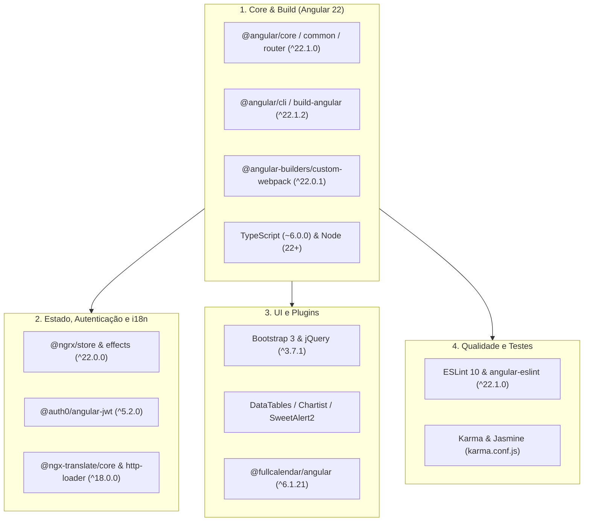

# Guia Específico — Atualização de Pacotes (SmartDigitalPsicoUIDashboard)

**Projeto:** `SmartDigitalPsicoUIDashboard`  
**Caminho:** [SmartDigitalPsicoUIDashboard](file:///c:/git/SMARTDIGITALPSICO/SmartDigitalPsicoUIDashboard)  
**Manifesto:** [package.json](file:///c:/git/SMARTDIGITALPSICO/SmartDigitalPsicoUIDashboard/package.json)  
**Guia Base Genérico:** [GuiaGenericoAtualizacaoPacotesFrontend.md](file:///c:/git/SMARTDIGITALPSICO/SmartDigitalPsicoUIDashboard/DOCUMENTACAO/UpdatePackages/GuiaGenericoAtualizacaoPacotesFrontend.md)  
**Data:** 2026-08-22  

---

## 1. Contexto Arquitetural do Projeto

O **SmartDigitalPsicoUIDashboard** é o painel web SPA em **Angular 22** do ecossistema SmartDigitalPsico. Ele integra uma combinação de componentes modernos do Angular (NgRx 22, ngx-translate 18, FullCalendar 6) com o tema visual *Light Bootstrap Dashboard Pro* baseado em **Bootstrap 3**, **jQuery 3.7.1** e plugins legados carregados via **custom-webpack** e scripts globais no [angular.json](file:///c:/git/SMARTDIGITALPSICO/SmartDigitalPsicoUIDashboard/angular.json).



---

## 2. Inventário de Dependências e Blocos do Projeto

### Bloco A — Core Framework & Builder (Angular 22)
Pacotes centrais do Angular e builder customizado:
- `@angular/animations`, `@angular/cdk`, `@angular/common`, `@angular/compiler`, `@angular/core`, `@angular/elements`, `@angular/forms`, `@angular/google-maps`, `@angular/localize`, `@angular/platform-browser`, `@angular/platform-browser-dynamic`, `@angular/router` (`^22.1.0`)
- `@angular/cli`, `@angular-devkit/build-angular` (`^22.1.2`)
- `@angular-builders/custom-webpack` (`^22.0.1`)
- `rxjs` (`~7.8.0`) e `zone.js` (`^0.15.1`)

### Bloco B — Estado, Autenticação e Internacionalização (i18n)
- `@ngrx/store`, `@ngrx/effects`, `@ngrx/store-devtools` (`^22.0.0-beta.0`)
- `@auth0/angular-jwt` (`^5.2.0`)
- `@ngx-translate/core` (`^18.0.0`), `@ngx-translate/http-loader` (`^18.0.0`)
- `ngx-translate-messageformat-compiler` (`^7.3.0`), `@messageformat/core` (`^3.4.0`)

### Bloco C — Componentes Visuais, Gráficos e Calendário
- `@fullcalendar/angular` (`^6.1.21`), `@fullcalendar/core`, `@fullcalendar/daygrid`, `@fullcalendar/interaction`, `@fullcalendar/timegrid` (`^6.1.15`)
- `@kolkov/angular-editor` (`^3.0.3`)
- `angular-ng-autocomplete` (`^2.0.12`)
- `chartist` (`0.11.4`), `chartist-plugin-zoom` (`0.6.0`)
- `sweetalert2` (`10.12.5`), `nouislider` (`14.6.3`)

### Bloco D — Camada Legada (Bootstrap 3, jQuery & Plugins)
> [!NOTE]
> Esses pacotes fornecem o design system do template. Suas versões são fixadas e carregadas via scripts do `angular.json` e `custom-webpack.config.js`.
- `bootstrap` (`^3.4.1`), `bootstrap-notify` (`3.1.3`), `bootstrap-select` (`1.13.18`), `bootstrap-switch` (`3.4.0`), `jasny-bootstrap` (`4.0.0`), `twitter-bootstrap-wizard` (`1.2.0`)
- `jquery` (`^3.7.1`), `jquery-validation` (`^1.19.2`), `chosen-js` (`1.8.7`)
- `datatables`, `datatables.net`, `datatables.net-bs`, `datatables.net-responsive`
- `eonasdan-bootstrap-datetimepicker` (`^4.15.35`), `moment` (`^2.30.1`)

### Bloco E — Tooling, Linter e TypeScript
- `typescript` (`~6.0.0`) — **Trava**: limitado pelo compilador do Angular 22
- `eslint` (`^10.3.0`), `angular-eslint` (`^22.1.0`), `typescript-eslint` (`8.59.2`), `@eslint/js` (`^10.0.1`)
- `@types/node` (`^18.19.130`), `@types/jquery` (`3.5.2`), `@types/bootstrap` (`^3.4.0`), `@types/google.maps` (`^3.55.5`), `@types/chartist` (`0.11.0`)
- `ts-node` (`~10.9.1`)

### Bloco F — Testes Automatizados (Karma / Jasmine)
- `karma` (`~6.4.0`), `karma-chrome-launcher` (`~3.1.0`), `karma-coverage` (`~2.2.0`), `karma-jasmine` (`~5.1.0`), `karma-jasmine-html-reporter` (`~2.0.0`), `karma-junit-reporter` (`^2.0.1`)
- `jasmine-core` (`~4.4.0`), `jasmine-spec-reporter` (`~7.0.0`), `@types/jasmine` (`~4.0.0`)

---

## 3. Gestão de Overrides de Segurança

O projeto mantém a seção `overrides` no [package.json](file:///c:/git/SMARTDIGITALPSICO/SmartDigitalPsicoUIDashboard/package.json) para forçar versões seguras de dependências transitivas:

```json
"overrides": {
  "moment-timezone": "^0.5.48",
  "@hono/node-server": "^2.0.12",
  "uuid": "^11.1.1"
}
```

A cada ciclo de atualização:
- Verificar se `uuid`, `moment-timezone` ou `@hono/node-server` possuem novas correções de segurança.
- Não remover os overrides enquanto houver dependências transitivas exigindo versões obsoletas.

---

## 4. Procedimento Operacional Passo a Passo

### Passo 1: Validação do Ambiente e Diagnóstico

```powershell
cd SmartDigitalPsicoUIDashboard

# Validar versões de Node e NPM (deve atender engines: Node 22+)
node --version
npm --version

# Mapear pacotes desatualizados
npm outdated

# Checagem de vulnerabilidades em produção
npm audit --omit=dev
```

---

### Passo 2: Atualização Coesa do Angular e NgRx

Quando houver patch/minor do Angular 22:
```powershell
npm install @angular/animations@^22.1.3 @angular/cdk@^22.1.3 @angular/common@^22.1.3 @angular/compiler@^22.1.3 @angular/core@^22.1.3 @angular/elements@^22.1.3 @angular/forms@^22.1.3 @angular/google-maps@^22.1.3 @angular/localize@^22.1.3 @angular/platform-browser@^22.1.3 @angular/platform-browser-dynamic@^22.1.3 @angular/router@^22.1.3 @angular/cli@^22.1.5 @angular-devkit/build-angular@^22.1.5 @angular/compiler-cli@^22.1.3 @angular/language-service@^22.1.3
```

---

### Passo 3: Atualização de Ferramentas de Linter e Tooling

```powershell
npm install -D eslint@^10.4.0 angular-eslint@^22.1.0 typescript-eslint@latest
```

Executar o linter do projeto:
```powershell
npm run lint
```

---

### Passo 4: Execução dos Testes Automatizados

Executar a suíte de testes Karma / Jasmine:
```powershell
npm test -- --no-watch --browsers=ChromeHeadless
```
- Validar se os relatórios em `coverage/` e JUnit XML foram gerados corretamente.

---

### Passo 5: Build de Produção e Bump de Versão

O script `build:prod` executa o versionador automático (`scripts/bump-ui-version.js`) e compila em modo de produção:

```powershell
npm run build:prod
```

**Verificações pós-build:**
1. Inspecionar a pasta `dist/`:
   - Presença dos bundles `main.*.js`, `polyfills.*.js`, `styles.*.css`.
   - Geração de assets de fontes (`fonts/`), imagens e traduções (`assets/i18n/`).
2. Verificar se o bundle principal não ultrapassou o orçamento configurado no `angular.json` (`initial` budget).

---

### Passo 6: Smoke Test Local e Docker

1. Teste de execução local:
```powershell
npm start
# Acessar http://localhost:4200/ e validar login, navegação no menu e carregamento de gráficos/tabelas
```

2. Teste de imagem Docker:
```powershell
docker build -t smartdigitalpsico-ui:latest .
docker compose -f docker-compose.yml up -d
```

---

## 5. Checklist de Entrega e Homologação

- [ ] `node --version` satisfaz `engines.node` (`^22.22.3 || ^24.15.0 || ^26.0.0`).
- [ ] `npm ci` executa do zero sem erros `ERESOLVE`.
- [ ] `npm run lint` executa sem erros impeditivos.
- [ ] `npm test` passa com 100% de testes unitários aprovados.
- [ ] `npm run build:prod` gera os artefatos minificados em `dist/`.
- [ ] `npm audit --omit=dev` sem vulnerabilidades High/Critical em runtime.
- [ ] `package.json` e `package-lock.json` commitados de forma sincronizada.

---

## 6. Referências

- [package.json](file:///c:/git/SMARTDIGITALPSICO/SmartDigitalPsicoUIDashboard/package.json)
- [angular.json](file:///c:/git/SMARTDIGITALPSICO/SmartDigitalPsicoUIDashboard/angular.json)
- [custom-webpack.config.js](file:///c:/git/SMARTDIGITALPSICO/SmartDigitalPsicoUIDashboard/custom-webpack.config.js)
- [GuiaGenericoAtualizacaoPacotesFrontend.md](file:///c:/git/SMARTDIGITALPSICO/SmartDigitalPsicoUIDashboard/DOCUMENTACAO/UpdatePackages/GuiaGenericoAtualizacaoPacotesFrontend.md)
- [RelatorioAtualizacaoAngular-SmartDigitalPsicoUIDashboard.md](file:///c:/git/SMARTDIGITALPSICO/SmartDigitalPsicoUIDashboard/DOCUMENTACAO/UI/RelatorioAtualizacaoAngular-SmartDigitalPsicoUIDashboard.md)
