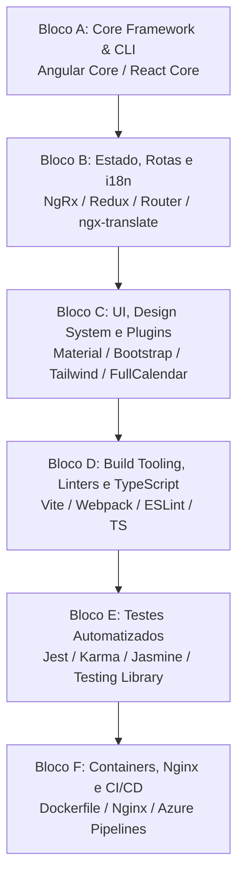

# Guia Genérico — Atualização de Pacotes Frontend (Angular e React / npm)

**Documento:** Guia operacional reutilizável para ecossistemas frontend  
**Data:** 2026-08-22  
**Aplicabilidade:** Projetos SPA, SSR e SDKs TypeScript/JavaScript baseados em **Angular** ou **React** gerenciados via `npm` (ou `pnpm`/`yarn`).  

---

## 1. Objetivo

Padronizar o processo de governança, levantamento e atualização de dependências de frontend em projetos **Angular** e **React**, garantindo:

1. **Estabilidade e Não-Regressão**: Preservar contratos de rotas, consumo de APIs REST/GraphQL, componentes visuais e autenticação (JWT/OAuth/OIDC).
2. **Coesão do Ecossistema**: Alinhar pacotes centrais de cada framework na mesma versão/patch e respeitar rigorosamente as versões de TypeScript e Node.js suportadas.
3. **Segurança de Dependências**: Eliminar vulnerabilidades em dependências de produção (`npm audit --omit=dev`), tratando dependências transitivas e de build com overrides controlados.
4. **Reprodutibilidade de Build**: Manter o lockfile (`package-lock.json`) 100% íntegro e sincronizado com o manifesto (`package.json`).
5. **Automação de CI/CD**: Garantir compilação limpa em modo de produção (`build:prod`), linting sem warnings bloqueantes e execução de suítes de testes unitários/e2e.

---

## 2. Escopo e Não Escopo

### 2.1 Escopo

| Categoria | Ação |
| --------- | ---- |
| **Frameworks Core** | Atualizar `@angular/*` + `@angular/cli` ou `react` + `react-dom` + `@types/react*` |
| **Estado e Roteamento** | Atualizar gerenciadores de estado (NgRx, Redux Toolkit, Zustand, Pinia) e roteadores (`@angular/router`, `react-router`, `@tanstack/react-router`) |
| **Bibliotecas de UI e Componentes** | Atualizar bibliotecas de componentes (Material, CDK, PrimeNG, Bootstrap, Tailwind, MUI, Ant Design, Chakra UI, FullCalendar) respeitando `peerDependencies` |
| **Internacionalização (i18n)** | Atualizar `@ngx-translate/*`, `i18next`, `react-i18next`, `@messageformat/*` |
| **Tooling, Bundlers e Linters** | Alinhar TypeScript, Vite, Webpack, ESLint (flat config), Prettier, loaders e plugins |
| **Frameworks de Testes** | Atualizar Jest, Vitest, Karma, Jasmine, Testing Library, Playwright, Cypress |
| **Infraestrutura Frontend** | Atualizar imagens Docker (Nginx/Node), `nginx.conf`, scripts de bump de versão e pipelines CI/CD |

### 2.2 Não Escopo

- Reescrita completa de componentes ou redesign de telas não relacionados a quebras de API do pacote
- Migração não planejada de arquitetura (ex.: troca de NgModules para Standalone ou troca de Webpack para Vite sem RFC dedicada)
- Alterações em regras de negócio ou contratos de integração com APIs backend
- Introdução de novas bibliotecas de terceiros sem aprovação prévia

---

## 3. Princípios Fundamentais de Governança Frontend

1. **Inventário Antes de Alterar**: Jamais aplicar `npm update` às cegas. Executar `npm outdated` e `npm audit` para mapear o cenário completo.
2. **Atualização por Blocos Coesos**:
   - No **Angular**: Todos os pacotes `@angular/*`, `@angular/cli`, `@angular-devkit/*` e `@angular/compiler-cli` devem estar rigorosamente no mesmo patch/minor.
   - No **React**: `react`, `react-dom`, `@types/react` e `@types/react-dom` devem estar alinhados na mesma major/minor.
3. **Compatibilidade Rígida de TypeScript e Node.js**:
   - O framework dita a versão suportada do TypeScript (especialmente no Angular). Nunca forçar uma versão de TypeScript incompatível com o compilador do framework.
   - O campo `engines.node` no `package.json` deve corresponder à versão do Node instalada no ambiente de desenvolvimento, Dockerfile e pipeline de CI/CD.
4. **Migrações Major Passo a Passo (Angular)**:
   - Em upgrades de major do Angular (ex.: v14 → v15 → … → v22), nunca pular versões diretamente. Utilizar `ng update` versão por versão para executar os *schematics* de migração automática de templates, injeção de dependência e APIs deprecadas.
5. **Lockfile Obrigatório e Sincronizado**: O arquivo `package-lock.json` deve sempre ser commitado junto com o `package.json`. Em CI/CD e testes locais do zero, usar estritamente `npm ci`.
6. **Controle de Overrides**: Utilizar a seção `overrides` do `package.json` apenas para corrigir vulnerabilidades transitivas críticas ou evitar conflitos de peer dependencies onde a biblioteca upstream ainda não publicou release compatível.

---

## 4. Blocos Estruturais de Dependências



### 4.1 Mapeamento por Ecossistema

| Bloco | Ecossistema Angular | Ecossistema React |
| ----- | ------------------- | ----------------- |
| **Bloco A — Core & CLI** | `@angular/core`, `@angular/common`, `@angular/forms`, `@angular/router`, `@angular/cli`, `@angular-devkit/build-angular`, `zone.js`, `rxjs` | `react`, `react-dom`, `@types/react`, `@types/react-dom`, `vite` / `next` / `@vitejs/plugin-react` |
| **Bloco B — Estado, Rotas & i18n** | `@ngrx/store`, `@ngrx/effects`, `@auth0/angular-jwt`, `@ngx-translate/core`, `@ngx-translate/http-loader` | `@reduxjs/toolkit`, `react-redux`, `zustand`, `react-router-dom`, `i18next`, `react-i18next` |
| **Bloco C — UI & Plugins** | `@angular/cdk`, `@angular/material`, `primeng`, `bootstrap`, `sweetalert2`, `@fullcalendar/angular`, `@kolkov/angular-editor` | `@mui/material`, `@chakra-ui/react`, `antd`, `tailwindcss`, `lucide-react`, `@fullcalendar/react` |
| **Bloco D — Tooling & Linters** | `typescript`, `@angular-builders/custom-webpack`, `eslint`, `angular-eslint`, `typescript-eslint`, `ts-node` | `typescript`, `eslint`, `typescript-eslint`, `eslint-plugin-react-hooks`, `prettier`, `vite` |
| **Bloco E — Testes** | `karma`, `jasmine-core`, `karma-jasmine`, `karma-coverage`, `jest-preset-angular` | `vitest`, `jest`, `@testing-library/react`, `@testing-library/jest-dom`, `ts-jest`, `jsdom` |
| **Bloco F — Infra & Deploy** | `Dockerfile` (Nginx multi-stage), `nginx.conf`, scripts de bump de versão | `Dockerfile` (Node/Nginx), `.dockerignore`, `azure-pipelines.yml` |

---

## 5. Roteiro Operacional de Atualização

### 5.1 Fase 0 — Diagnóstico e Inventário

Executar na raiz do projeto frontend:

```powershell
# 1. Validar versões do ambiente
node --version
npm --version

# 2. Listar pacotes desatualizados
npm outdated

# 3. Auditoria de vulnerabilidades
npm audit --omit=dev
npm audit

# 4. Inspecionar árvore de dependências
npm ls --depth=0
```

Montar a tabela do **Conjunto Homologado do Ciclo**:

| Pacote | Versão Atual | Versão Proposta | Latest | Justificativa se != Latest |
| ------ | ------------ | --------------- | ------ | -------------------------- |

---

### 5.2 Fase 1 — Atualização do Core Framework

#### Para Projetos Angular:
```powershell
# Atualização de patch/minor dentro da mesma major:
npm install @angular/core@<versao> @angular/common@<versao> @angular/forms@<versao> @angular/router@<versao> @angular/cli@<versao> @angular-devkit/build-angular@<versao>

# Atualização de Major (utiliza schematics oficiais):
npx @angular/cli@<major> update @angular/core@<major> @angular/cli@<major>
```

#### Para Projetos React:
```powershell
npm install react@<versao> react-dom@<versao>
npm install -D @types/react@<versao> @types/react-dom@<versao>
```

---

### 5.3 Fase 2 — Atualização de Estado, Rotas e i18n

Atualizar os pacotes satélites verificando se suas versões suportam a major do framework:
```powershell
# Exemplo Angular:
npm install @ngrx/store@<versao> @ngrx/effects@<versao> @ngx-translate/core@<versao>

# Exemplo React:
npm install @reduxjs/toolkit@<versao> react-router-dom@<versao> i18next@<versao>
```

---

### 5.4 Fase 3 — UI, Design System e Plugins

Atualizar bibliotecas visuais:
- Validar se o tema CSS e variáveis globais não sofreram *breaking changes*.
- Para plugins legados (ex.: plugins jQuery ou Bootstrap antigos), verificar compatibilidade com o modo estrito de compilação do TypeScript.

---

### 5.5 Fase 4 — Tooling, Linters e TypeScript

1. Atualizar TypeScript estritamente dentro da faixa homologada pelo compilador do framework.
2. Atualizar ESLint e plugins associados:
```powershell
npm install -D eslint@<versao> typescript-eslint@<versao>
```
3. Executar o linter para validar conformidade:
```powershell
npm run lint
```

---

### 5.6 Fase 5 — Testes Automatizados e Qualidade

1. Atualizar runners e bibliotecas de asserção:
```powershell
# Rodar suíte completa de testes unitários:
npm test
```
2. Garantir que a cobertura de código seja gerada sem falhas e sem regressão nas métricas.

---

### 5.7 Fase 6 — Build de Produção, Docker e Smoke Test

1. Validar compilação otimizada para produção:
```powershell
npm run build:prod
# ou: npm run build
```
2. Inspecionar a pasta de saída (`dist/` ou `build/`):
   - Verificar tamanho dos bundles (chunks principais e lazy modules).
   - Confirmar geração correta de assets estáticos, fontes e favicons.
3. Testar execução local:
```powershell
npm start
# Acessar http://localhost:4200 (Angular) ou http://localhost:5173 / http://localhost:3000 (React)
```
4. Testar build do contêiner Docker:
```powershell
docker build -t frontend-app:latest .
```

---

## 6. Checklist de Validação Obrigatório

- [ ] **Instalação Limpa**: `npm ci` executa do zero sem erros de peer dependencies (`ERESOLVE`).
- [ ] **Linter Aprovado**: `npm run lint` passa com 0 erros.
- [ ] **Testes Verdes**: 100% dos testes unitários executados e aprovados (`npm test`).
- [ ] **Build de Produção**: `npm run build:prod` gera os bundles minificados sem erros.
- [ ] **Auditoria de Segurança**: `npm audit --omit=dev` sem vulnerabilidades High ou Critical em produção.
- [ ] **Smoke Test de Navegação**:
  - Tela de Login e autenticação operando normalmente.
  - Guardas de rota e redirecionamentos funcionando.
  - Chamadas HTTP para o backend REST/GraphQL enviando headers corretos (`Authorization: Bearer ...`).
  - Carregamento de módulos lazy-loaded sem erro 404 de chunks.
- [ ] **Lockfile Commitado**: `package.json` e `package-lock.json` commitados juntos.

---

## 7. Plano de Rollback

Em caso de quebra impeditiva durante a atualização:

```powershell
git checkout <branch-do-ciclo>
git reset --hard <commit-baseline>

# Limpeza completa de node_modules e cache
rm -rf node_modules package-lock.json
npm cache clean --force
npm ci

# Revalidar estado anterior
npm test
npm run build:prod
```

---

## 8. Tratamento de Riscos e Problemas Comuns

| Cenário / Erro | Causa Raiz | Solução Recomendada |
| -------------- | ---------- | ------------------- |
| `ERESOLVE could not resolve dependency` | Pacote de terceiro ainda não declarou suporte à major do framework | 1. Verificar se existe versão mais recente do pacote.<br>2. Se for seguro, utilizar `overrides` no `package.json` em vez de `--force`. |
| Erro de compilação TS (`TS2304`, `TS2345`) | TypeScript foi atualizado para versão além da suportada pelo framework | Fazer downgrade do TypeScript para a faixa homologada pelo Angular/Vite. |
| Chunk missing / Lazy load 404 em runtime | Hash de arquivos desatualizado no Nginx após deploy | Configurar headers de cache `Cache-Control: no-cache` no `index.html` e `max-age=31536000` nos arquivos com hash. |
| Avisos de CommonJS / AMD dependencies | Bibliotecas antigas que não utilizam módulos ES (ESM) | Avaliar migração para alternativas ESM modernas ou adicionar supressão controlada no `angular.json` / `vite.config.ts`. |
| Vulnerabilidade em dependência transitiva de dev | Pacote transitivo de tooling (ex.: esbuild, webpack-dev-server) | Monitorar release upstream; usar `overrides` no `package.json` apenas se não quebrar o build. |
