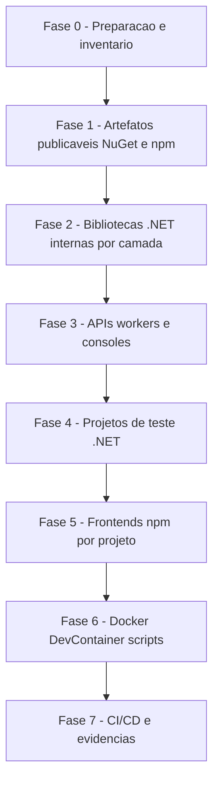

# Guia Genérico — Atualização de Pacotes (.NET NuGet e Frontend npm)

**Documento:** Guia operacional reutilizável  
**Baseado em:** `DOCUMENTACAO/UpdateDotNet10/RascunhoPlanoUpdateDotNet10.md`, `PlanoAcaoMigracaoDotNet10.md` e `RelatorioMigracaoDotNet10.md`  
**Data:** 2026-07-31  
**Aplicabilidade:** Qualquer ciclo de atualização de dependências deste repositório (rotina mensal, upgrade de major, migração de runtime/framework). Aplicar a seção de npm somente quando existirem projetos frontend no repositório.

**Ciclo corrente (exemplo concreto):** migração **SmartDigitalPsicoAPI** .NET 8 → .NET 10 — ver `DOCUMENTACAO/API/2026-07-LevantamentoConjuntoHomologado-SmartDigitalPsicoAPI.md` e `DOCUMENTACAO/API/PlanoImplementacaoMigracaoDotNet10-SmartDigitalPsicoAPI.md`.

---

## 1. Objetivo

Padronizar como atualizar dependências de pacotes em todo o repositório, preservando:

- Compatibilidade dos artefatos distribuídos externamente (pacotes NuGet e npm publicáveis) com consumidores em versões anteriores
- Integridade de migrations, seeds, contratos de API e schemas
- Funcionamento de APIs, consoles, workers, DI, logging, telemetria e middlewares
- Build local, Docker, DevContainer e pipelines CI/CD
- Zero alteração de regra de negócio ou contrato público durante o ciclo de atualização

Este guia é genérico: as versões concretas de cada ciclo devem ser registradas em um documento filho por execução (o "Conjunto Homologado" daquele ciclo — ver Seção 5), nunca hardcoded aqui.

---

## 2. Escopo e não escopo

### 2.1 Escopo

| Categoria | Ação |
| --------- | ---- |
| Projetos .NET (bibliotecas, APIs, testes, workers, consoles) | Atualizar pacotes NuGet; atualizar TFM apenas em ciclos de migração de runtime |
| Pacotes NuGet publicáveis (SDKs), quando existirem | Atualizar preservando multi-targeting e consumidores legados |
| Projetos npm (apps frontend e SDKs TypeScript), quando existirem | Atualizar `dependencies`/`devDependencies`, respeitando `engines`, `peerDependencies` e `overrides` |
| Dockerfiles, docker-compose, DevContainer | Atualizar imagens base somente quando o ciclo envolver mudança de runtime |
| Scripts (PowerShell/Shell/Node) com paths ou versões hardcoded | Atualizar referências |
| Pipelines CI/CD | Alinhar versão de SDK .NET / Node.js |

### 2.2 Não escopo

- Alteração de regras de negócio, contratos REST, payloads JSON ou schemas de banco sem necessidade técnica
- Refatoração de domínio ou preferências arquiteturais não relacionadas à atualização
- Reescrita de testes além do necessário para compilar/executar nas novas versões
- Troca de bibliotecas por equivalentes (isso é decisão arquitetural separada, com RFC própria)

Qualquer mudança fora do escopo deve ser registrada e tratada em PR separado.

---

## 3. Princípios obrigatórios (valem para NuGet e npm)

1. **Inventário antes de alterar** — nunca atualizar sem primeiro gerar a lista do que está desatualizado e vulnerável (Seção 4).
2. **Conjunto Homologado por ciclo** — cada ciclo de atualização produz uma tabela "pacote / versão atual / versão a aplicar / latest disponível / justificativa quando não for a latest". Só entram versões estáveis (sem `preview`, `rc`, `beta`, `next`, `canary`) em produção.
3. **Atualizar por blocos coesos, nunca pacote a pacote isolado** — pacotes do mesmo ecossistema sobem juntos (ex.: todos `Microsoft.AspNetCore.*` no mesmo patch; todos `@angular/*` na mesma minor; toda a família `jest*` alinhada).
4. **Respeitar dependências rígidas do grafo** — quando um pacote trava a major de outro (ex.: provider de banco travando a major do ORM; `peerDependencies` de uma lib de UI travando a major do framework), documentar a trava e NÃO forçar a latest. Registrar a condição de destrave para o próximo ciclo ("Conjunto v2 futuro").
5. **Abordagem incremental por fases** — validar build/teste ao final de cada fase; nunca alterar tudo de uma vez.
6. **Centralização de versões** — .NET usa Central Package Management (`Directory.Packages.props` como fonte única; `.csproj` sem atributo `Version`). npm usa o `package.json` de cada projeto + lockfile commitado; `overrides` para forçar versões transitivas quando necessário.
7. **Não remover compatibilidade dos artefatos publicáveis** — SDKs NuGet mantêm multi-targeting (`TargetFrameworks` com os TFMs suportados); SDKs npm mantêm `engines` e ranges de `peerDependencies` compatíveis com os consumidores atuais (só estreitar range em major bump consciente do pacote).
8. **Branch dedicada com commits por fase** — ex.: `chore/update-packages-YYYY-MM` ou `chore/update-packages-smartdigitalpsicoapi-dotnet10`.
9. **Major bump exige atenção individual** — ler changelog/breaking changes antes de aplicar; um major de terceiro nunca sobe "de carona" no lote.
10. **Nenhuma migration/schema novo por causa de atualização** — se a atualização gerar migration não-vazia ou diff de schema, investigar antes de commitar.

---

## 4. Fase de inventário (sempre a primeira)

### 4.1 .NET / NuGet

Exemplo para a solução corrente:

```powershell
cd SmartDigitalPsicoAPI
dotnet --list-sdks
dotnet list SmartDigitalPsicoAPI.sln package --outdated
dotnet list SmartDigitalPsicoAPI.sln package --vulnerable --include-transitive
dotnet list SmartDigitalPsicoAPI.sln package
```

Gerar tabelas:

| Projeto | Tipo | TFM atual | Publicável? |
| ------- | ---- | --------- | ----------- |

| Pacote | Versão atual | Latest stable | Versão a aplicar | Justificativa se diferente da latest |
| ------ | ------------ | ------------- | ---------------- | ------------------------------------ |

Inventário de referência do ciclo .NET 10: `DOCUMENTACAO/API/2026-07-LevantamentoConjuntoHomologado-SmartDigitalPsicoAPI.md`.

### 4.2 Frontend / npm (quando projetos existirem)

Localizar os projetos: todo diretório com `package.json` que não seja `node_modules`. Revalidar a cada ciclo (caminhos variam por repositório).

Comandos por projeto:

```powershell
cd <pasta-do-projeto>
node --version            # deve satisfazer "engines" do package.json
npm outdated
npm audit --omit=dev      # vulnerabilidades de produção primeiro
npm ls --depth=0
```

Gerar a mesma tabela de Conjunto Homologado (pacote / atual / latest / aplicar / justificativa).

> No ciclo SmartDigitalPsicoAPI .NET 10, frontend/npm está **fora de escopo**.

---

## 5. Conjunto Homologado — regras de montagem

### 5.1 Blocos .NET (modelo)

Organizar o conjunto em blocos, na ordem de dependência:

- **Bloco A — Plataforma** (`Microsoft.AspNetCore.*`, `Microsoft.Extensions.*`, `System.Text.Json`): todos no MESMO patch do ciclo do runtime alvo.
- **Bloco B — Persistência** (`Microsoft.EntityFrameworkCore.*` + providers `Pomelo`, `Npgsql`, `SqlServer`, `InMemory` + mocks de EF): todos na MESMA major, limitada pela major suportada pelo provider mais restritivo. Documentar a trava (ex.: "Pomelo 9 exige EF <= 9") e a condição de destrave.
- **Bloco C — OpenAPI, logging, telemetria** (Swashbuckle/Scalar, Serilog e sinks, Application Insights/OpenTelemetry): Swashbuckle segue a major do ASP.NET Core.
- **Bloco D — Domínio, utilitários e integrações** (FluentValidation, AutoMapper, Newtonsoft, Polly, Azure.*, WebJobs, etc.): latest estável, com atenção a licenças em majors novos (ex.: AutoMapper 15+ é dual-licensed).
- **Bloco E — Testes** (Test.Sdk, NUnit/xunit, Moq, coverlet, Moq.EntityFrameworkCore): latest estável; mocks acoplados a EF seguem o Bloco B (ex.: Moq.EF **9.x** com EF **9**, não Moq.EF 10).

Dependências rígidas típicas (validar a cada ciclo):

| Se usar | Então obrigatoriamente |
| ------- | ---------------------- |
| Provider de banco na major N | Todos `Microsoft.EntityFrameworkCore.*` na major N |
| Runtime `netX.0` em Web API | Todos `Microsoft.AspNetCore.*` no patch do ciclo X |
| Qualquer `Microsoft.AspNetCore.*` X.y | `Microsoft.Extensions.*` e `System.Text.Json` no mesmo X.y |
| Swashbuckle major M | ASP.NET Core compatível com M (não segurar major antiga) |
| Moq.EntityFrameworkCore major N | EF Core na major N |

Aplicação: todas as versões entram/atualizam em `SmartDigitalPsicoAPI/Directory.Packages.props` (ou caminho equivalente da solução); `.csproj` permanecem sem `Version=`.

### 5.2 Blocos npm (modelo)

- **Bloco F — Framework** (`@angular/*` ou `react` + Vite): mesma major/minor entre si.
- **Bloco G — UI e ecossistema**: conferir `peerDependencies` antes de subir.
- **Bloco H — Build e tooling** (typescript, vite/tsup, eslint): TypeScript limitado ao range suportado pelo framework.
- **Bloco I — Testes** (jest + adapters): família alinhada na mesma major.
- **Overrides**: revisar a cada ciclo — remover os obsoletos.

Regras npm:

1. Atualizar via `npm install <pkg>@<versao-exata-homologada>` ou editando o `package.json` + `npm install` — SEMPRE commitar o `package-lock.json` resultante.
2. `npm audit fix` sem `--force`; correções que exijam major passam pelo fluxo de major bump.
3. Respeitar/atualizar `engines.node` em conjunto com a versão de Node dos pipelines e DevContainer.
4. Para SDKs npm publicáveis: `peerDependencies` só estreitam range em major do SDK; validar `npm pack` após bump de tooling.

---

## 6. Plano de execução por fases



- **Fase 0 — Preparação**: branch dedicada; inventário (Seção 4); montar Conjunto Homologado (Seção 5); commit baseline com build e testes verdes no estado atual.
- **Fase 1 — Publicáveis primeiro**: SDKs NuGet (multi-target) e SDK npm, **quando existirem**. No ciclo SmartDigitalPsicoAPI não há pacote NuGet publicável — pular ou registrar N/A.
- **Fase 2 — Bibliotecas internas .NET**: ordem de dependência (ex.: Domain → Data → Service), com build parcial por projeto.
- **Fase 3 — APIs, workers e consoles**: aplicar blocos A/C; startup manual de cada host (checklist 7.4).
- **Fase 4 — Testes .NET**: Bloco E; suíte completa (`dotnet test`).
- **Fase 5 — Frontends npm**: um projeto por vez, quando existirem no ciclo.
- **Fase 6 — Containers e scripts**: somente se o ciclo mudou runtime (.NET/Node): imagens base dos Dockerfiles (`aspnet`/`sdk`), scripts com paths `bin/Debug/netX.0`.
- **Fase 7 — CI/CD e evidências**: versão de SDK .NET (`UseDotNet@2`) e de Node nos pipelines; gerar relatório final (Seção 9).

Exemplo fase a fase do ciclo .NET 10: `DOCUMENTACAO/API/PlanoImplementacaoMigracaoDotNet10-SmartDigitalPsicoAPI.md`.

---

## 7. Checklist de validação

### 7.1 .NET — build e restore

```powershell
cd SmartDigitalPsicoAPI
dotnet restore SmartDigitalPsicoAPI.sln
dotnet build SmartDigitalPsicoAPI.sln -c Release
```

- [ ] Restore sem `NU1107` (conflito de versão) e `NU1202` (TFM incompatível)
- [ ] Build Release com 0 erros; warnings novos de obsolescência corrigidos ou justificados
- [ ] Warnings `NU1510` (PackageReference redundante) anotados para limpeza em PR separado

### 7.2 .NET — testes

```powershell
dotnet test SmartDigitalPsicoAPI.sln -c Release --no-build
dotnet test SmartDigitalPsicoAPI.sln -c Release /p:CollectCoverage=true /p:CoverletOutputFormat=opencover
```

- [ ] 100% dos testes passando
- [ ] Cobertura sem regressão injustificada (meta do time, se houver)

### 7.3 .NET — EF Core / migrations

```powershell
cd SmartDigitalPsicoAPI
dotnet ef migrations list `
  --project SmartDigitalPsico.Data/SmartDigitalPsico.Data.csproj `
  --startup-project SmartDigitalPsico.WebAPI/SmartDigitalPsico.WebAPI.csproj
dotnet ef database update `
  --project SmartDigitalPsico.Data/SmartDigitalPsico.Data.csproj `
  --startup-project SmartDigitalPsico.WebAPI/SmartDigitalPsico.WebAPI.csproj
```

- [ ] `migrations list` e `database update` em banco limpo sem erro
- [ ] Técnica da migration temporária: gerar migration `ValidacaoPosUpdate`; se vier com `Up`/`Down` VAZIOS, a atualização não alterou schema (esperado) — remover com `dotnet ef migrations remove --force`. Se vier não-vazia, investigar antes de commitar
- [ ] Seeds consistentes
- [ ] Validar ambos os providers usados (SqlServer e/ou MySQL/Pomelo)

### 7.4 .NET — execução das APIs / workers

```powershell
dotnet run --project SmartDigitalPsico.WebAPI/SmartDigitalPsico.WebAPI.csproj
# Opcional smoke:
# dotnet run --project SmartDigitalPsico.WindowsService/SmartDigitalPsico.WindowsService.csproj
# dotnet run --project SmartDigitalPsico.WebJob/SmartDigitalPsico.WebJob.csproj
```

- [ ] Startup sem `InvalidOperationException` de DI
- [ ] Health/Swagger acessíveis conforme o host
- [ ] Auth smoke (JWT) em endpoint protegido
- [ ] Logs sem segredos

### 7.5 .NET — pack dos SDKs publicáveis

Quando existirem pacotes NuGet publicáveis:

```powershell
dotnet pack <ProjetoSdk>.csproj -c Release -o ./artifacts/nupkg
# Inspecionar lib/<tfm>/ no .nupkg
```

- [ ] Pacote contém uma pasta `lib/` por TFM declarado
- [ ] Consumo validado no TFM mais antigo suportado

> SmartDigitalPsicoAPI: **N/A** (sem pacote publicável neste ciclo).

### 7.6 npm — por projeto frontend

```powershell
cd <pasta-do-projeto>
npm ci
npm run lint
npm test
npm run build:prod
```

- [ ] `npm ci` sem erros de peer dependency
- [ ] Lint / testes / build de produção OK
- [ ] `npm audit` sem vulnerabilidades high/critical em produção

### 7.7 npm — SDK publicável

Quando existir SDK npm no ciclo: `npm pack --dry-run`, validar `dist/` e `peerDependencies`.

---

## 8. Docker, DevContainer, scripts e CI/CD (quando o runtime mudar)

| Item | O que verificar |
| ---- | --------------- |
| Dockerfiles backend | `mcr.microsoft.com/dotnet/aspnet:<versao>` e `sdk:<versao>` (ex.: **10.0**); manter usuário non-root, volumes, `UseAppHost=false` |
| Dockerfiles/pipelines frontend | Imagem/task de Node alinhada ao `engines.node` |
| DevContainer | Imagem dotnet alinhada; `dotnet --version` e `node --version` corretos |
| docker-compose | `docker compose build --no-cache && docker compose up -d`; containers healthy |
| Pipelines Azure DevOps | `UseDotNet@2` com `version: '<X>.x'`; paths dos projetos corretos |
| Scripts | Buscar por versões hardcoded: `net8.0`, `net10.0`, paths `bin/Debug/` em `*.ps1`, `*.sh` |

Exemplo SmartDigitalPsicoAPI: atualizar `Dockerfile` (raiz) e `SmartDigitalPsico.WebAPI/Dockerfile`.

---

## 9. Evidências obrigatórias da entrega

1. **Conjunto Homologado do ciclo** — tabela final aplicada (NuGet + npm), com justificativas das versões seguradas e a lista de travas para o próximo ciclo ("Conjunto v2 futuro").
2. **Lista de arquivos alterados** — `Directory.Packages.props`, `.csproj`, `package.json` + lockfiles, Dockerfiles, DevContainer, pipelines, scripts.
3. **Relatório quantitativo:**

```text
Projetos .NET atualizados: N
Pacotes NuGet atualizados: N
Projetos npm atualizados: N
Pacotes npm atualizados: N
Testes .NET executados/passando: N/N
Testes npm executados/passando: N/N
Vulnerabilidades resolvidas: N
Falhas encontradas/corrigidas: N/N
```

4. **Riscos residuais** — majors adiados, travas de grafo, warnings pendentes, consumidores externos a monitorar.

Modelo de relatório: `DOCUMENTACAO/UpdateDotNet10/RelatorioMigracaoDotNet10.md`.

---

## 10. Plano de rollback

```powershell
git checkout <branch-do-ciclo>
git reset --hard <commit-baseline>

# .NET
cd SmartDigitalPsicoAPI
dotnet restore SmartDigitalPsicoAPI.sln
dotnet build SmartDigitalPsicoAPI.sln -c Release
dotnet test SmartDigitalPsicoAPI.sln -c Release

# npm (por projeto, se aplicável)
cd <pasta-do-projeto>
npm ci && npm test
```

Restaurar em conjunto: `Directory.Packages.props`, `.csproj`, `package.json` + `package-lock.json` (sempre os dois juntos), Dockerfiles, DevContainer e pipelines.

---

## 11. Riscos e mitigações recorrentes

| Risco | Impacto | Mitigação |
| ----- | ------- | --------- |
| Provider trava major do ORM (ex.: Pomelo x EF) | Não é possível usar a latest do bloco | Segurar o bloco inteiro na major compatível; documentar destrave ("Conjunto v2") |
| Mistura de patches `Microsoft.*` | `NU1107`/restore instável | CPM (`Directory.Packages.props`) + bloco A no mesmo patch |
| Major bump silencioso de terceiro | Breaking em runtime | Major nunca sobe no lote; changelog + teste dirigido |
| `peerDependencies` incompatíveis (npm) | `ERESOLVE`/quebra em runtime | Subir framework e ecossistema juntos |
| Lockfile não commitado ou dessincronizado | Builds não reproduzíveis em CI | `npm ci` no checklist; lockfile sempre no mesmo commit do `package.json` |
| Artefato publicável perde compatibilidade | Consumidores externos quebram | Multi-targeting NuGet + smoke no TFM antigo |
| Migration não-vazia pós-update | Alteração de schema não intencional | Técnica da migration temporária (7.3); investigar antes de commitar |
| Pipelines com SDK/Node desalinhado | CI vermelho ou build divergente do local | Fase 7 obrigatória |
| Licenciamento em majors novos (AutoMapper 15+) | Obrigação comercial/copyleft | Verificar licença antes de major bump; registrar decisão |
| Mock de EF na major errada | Testes quebrados ou grafo inválido | Moq.EntityFrameworkCore segue a major do EF do Bloco B |

---

## 12. Modo de execução sugerido (para IA/agente)

1. Ler este guia e gerar o inventário completo (Seção 4) sem alterar nada.
2. Propor o Conjunto Homologado do ciclo em documento filho sob `DOCUMENTACAO/API/` (ex.: `AAAA-MM-LevantamentoConjuntoHomologado-<Solucao>.md`) e aguardar aprovação.
3. Executar por fases (Seção 6), commitando por fase, marcando os checklists (Seção 7).
4. Atualizar infraestrutura/CI apenas se o ciclo mudar runtime (Seção 8).
5. Entregar relatório final com evidências (Seção 9) e abrir PR.

---

## Referências

- `DOCUMENTACAO/UpdateDotNet10/RascunhoPlanoUpdateDotNet10.md` — RFC do ciclo .NET 10
- `DOCUMENTACAO/UpdateDotNet10/PlanoAcaoMigracaoDotNet10.md` — plano operacional resumido
- `DOCUMENTACAO/UpdateDotNet10/RelatorioMigracaoDotNet10.md` — template de evidências
- `DOCUMENTACAO/API/2026-07-LevantamentoConjuntoHomologado-SmartDigitalPsicoAPI.md` — Conjunto Homologado v1
- `DOCUMENTACAO/API/PlanoImplementacaoMigracaoDotNet10-SmartDigitalPsicoAPI.md` — checklist fase a fase
- `SmartDigitalPsicoAPI/Directory.Packages.props` — fonte única de versões NuGet (CPM), após implementação
